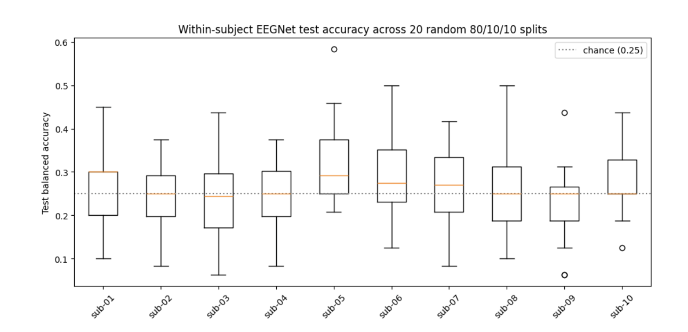
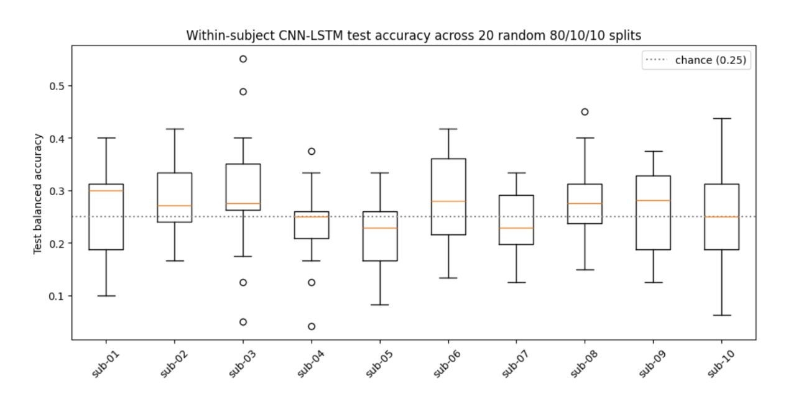
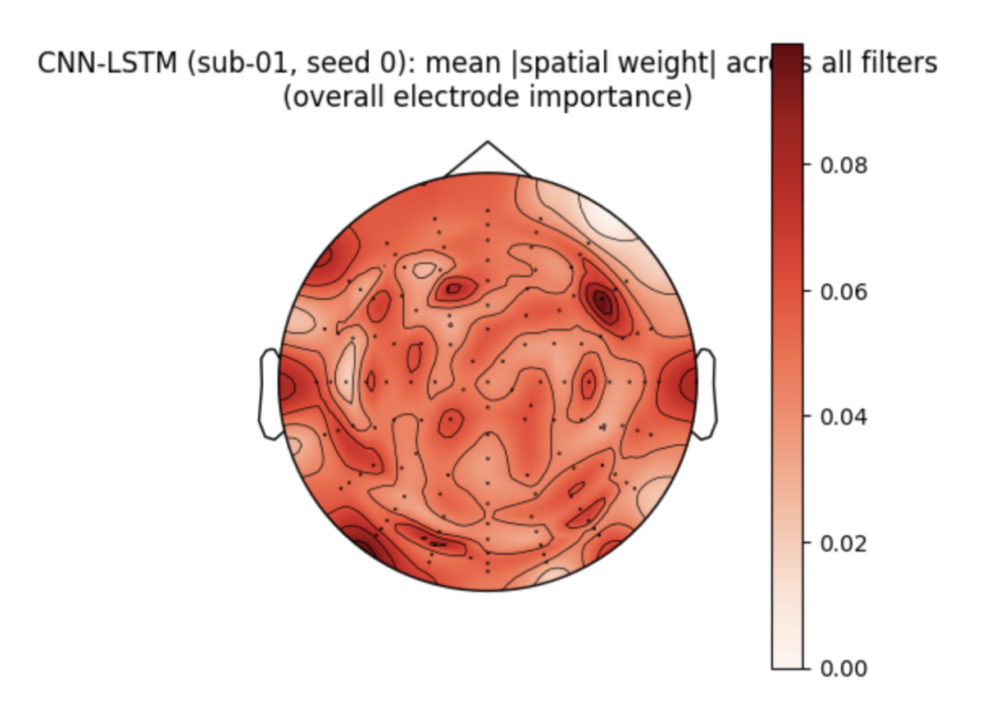
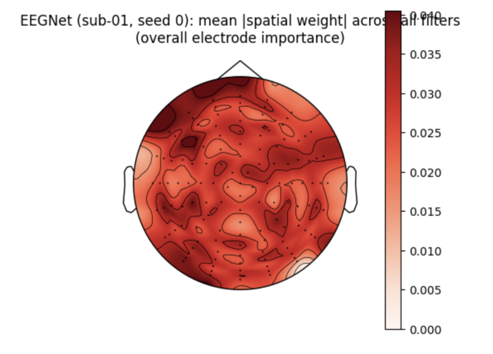
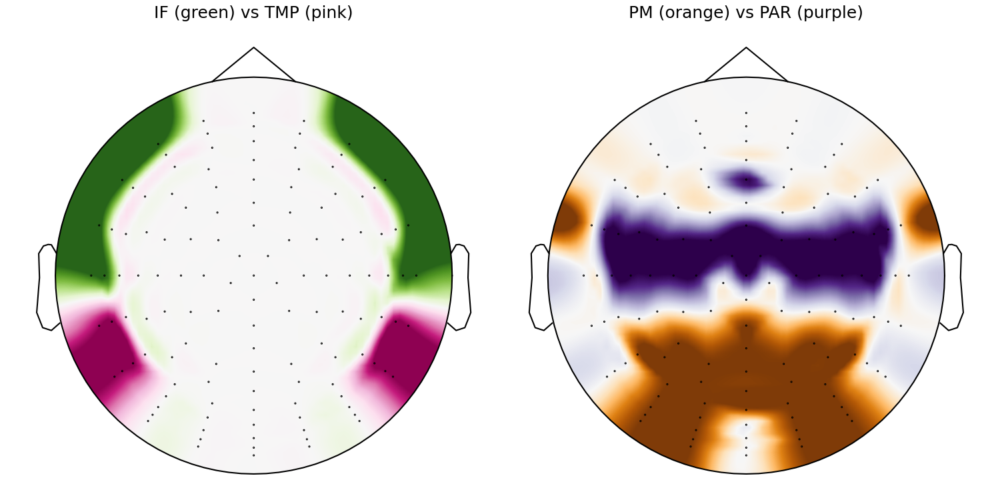
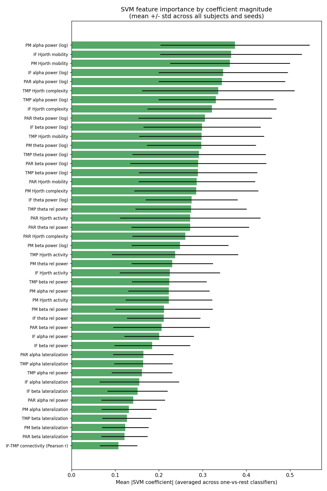
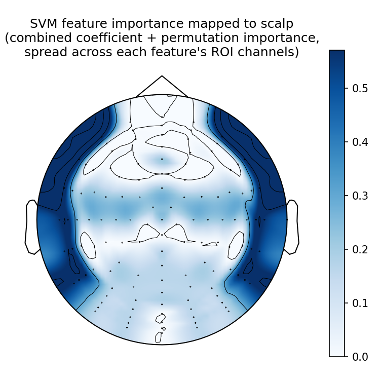

# Comparison of Inner Speech Classification with Deep Learning and Classical ML Methods

## Goal

My goal for this project was to compare deep learning methods (CNN-BiLSTM and EEGNet) against a classical ML method (SVM) on inner speech classification of four directional words (right/left/up/down, in Spanish). The main reason I did this project was to gain a better technical understanding of a section of BCIs that focus on decoding neural signals into words, which can aid people who do not have the ability to speak to still be able to communicate with their peers and loved ones.

## Methods

### Data

- Source: [NEMAR on003626](https://nemar.org/dataset/on003626)
- Preprocessed data downloaded following instructions from [nemarDatasets/on003626](https://github.com/nemarDatasets/on003626)
- 10 subjects (2 subjects each had one session that was corrupted after preprocessing and were excluded)
- 5,460 total trials across all three task conditions, but only 2,236 inner speech trials (~220 trials per subject) were used for this project
- 256 Hz sampling rate (confirmed after preprocessing)
- 128 EEG channels
- 2.5 seconds of the action interval kept per epoch
- Since each subject's data spans 3 recording sessions, each subject's EEG data was z-score standardized (per channel, across that subject's own trials) to account for scale differences across sessions

### Models

- **CNN-BiLSTM** — a custom architecture combining CNN (similar to EEGNet CNN layers) and RNN layers:
  - Temporal convolution ( kernel spanning 87 timesteps) to learn frequency/temporal filters, followed by batch normalization
  - Depthwise spatial convolution (spanning all 128 channels) to learn per-filter spatial patterns across electrodes, followed by batch normalization and an ELU activation
  - Average pooling + dropout to reduce the temporal resolution before the recurrent stage
  - A bidirectional LSTM layer (hidden size 16) to learn temporal dependencies across the trial in both directions, with its output mean-pooled over time
  - A final dropout + linear layer to classify into the 4 direction classes
- **EEGNet** — implemented via `braindecode.models.EEGNet`, (matched kernel length and filter counts from CNN-BiLSTM for a fair comparison), but without an added recurrent stage — EEGNet instead relies on its own separable convolutions and pooling to build the final representation before classification
- **SVM** — a linear SVM with class balance. Features were extracted from 4 anatomically-informed regions of interest (see the Results section below for the region list and full feature table) rather than learned end-to-end from the full 128-channel signal

### Evaluation

- Within-subject evaluation, 20 repeated random 80/10/10 train/val/test splits per subject (seeds 0-19), averaged
- 4-class balanced accuracy (chance level = 0.250)

## Results

All three models landed close to chance-level accuracy, with evidence of overfitting.

### EEGNet — Within-Subject Results

Setup: 20 repeated random 80/10/10 splits per subject, 4-class balanced accuracy (chance = 0.250)

| Subject | Mean ± Std (across 20 seeds) |
|---|---|
| sub-01 | 0.265 ± 0.091 |
| sub-02 | 0.248 ± 0.072 |
| sub-03 | 0.244 ± 0.096 |
| sub-04 | 0.250 ± 0.080 |
| sub-05 | 0.319 ± 0.093 |
| sub-06 | 0.285 ± 0.091 |
| sub-07 | 0.279 ± 0.090 |
| sub-08 | 0.270 ± 0.131 |
| sub-09 | 0.231 ± 0.086 |
| sub-10 | 0.281 ± 0.083 |

**Aggregate**

| Aggregation method | Balanced accuracy |
|---|---|
| Mean of per-subject means | 0.267 ± 0.024 |
| Pooled across all 200 subject-seed runs | 0.267 ± 0.096 |
| Average within-subject std across seeds | 0.091 (how much a single split's number moves around) |



### CNN-LSTM — Within-Subject Results

Setup: 20 repeated random 80/10/10 splits per subject, 4-class balanced accuracy (chance = 0.250)

| Subject | Mean ± Std (across 20 seeds) |
|---|---|
| sub-01 | 0.265 ± 0.087 |
| sub-02 | 0.283 ± 0.075 |
| sub-03 | 0.294 ± 0.114 |
| sub-04 | 0.235 ± 0.074 |
| sub-05 | 0.215 ± 0.075 |
| sub-06 | 0.288 ± 0.083 |
| sub-07 | 0.235 ± 0.066 |
| sub-08 | 0.283 ± 0.083 |
| sub-09 | 0.272 ± 0.080 |
| sub-10 | 0.247 ± 0.098 |

**Aggregate**

| Aggregation method | Balanced accuracy |
|---|---|
| Mean of per-subject means | 0.262 ± 0.026 |
| Pooled across all 200 subject-seed runs | 0.262 ± 0.088 |
| Average within-subject std across seeds | 0.083 (how much a single split's number moves around) |




### Spatial filter interpretability

To check what each deep model actually learned, the spatial filter weights of a representative model (sub-01, seed 0) were plotted back onto the scalp.

<p float="left">
  
  
</p>

*Left: CNN-LSTM. Right: EEGNet. Both show the mean absolute spatial filter weight per electrode, averaged across all filters, viewed from above with the nose pointing up.*


### Classical ML (SVM)

Instead of learning spatial/temporal filters end-to-end, the SVM used hand-crafted features extracted from 4 regions of interest, chosen for their hypothesized role in inner speech:

| Region (abbr.) | Function |
|---|---|
| Inferior Frontal (IF) | Language generation and phonetic structure (Broca's-area-adjacent) |
| Premotor / SMA (PM) | Internal speech planning and covert articulatory representations |
| Temporal (TMP) | Language and phonological representations |
| Parietal (PAR) | Higher-level language / phonological processing |

<details>
<summary>Full channel list (all 4 ROIs combined, BioSemi 128-channel names)</summary>

```
A1, A3, A4, A5, A6, A7, A8, A9, A10, A11, A12, A13, A14, A15, A16, A17, A18, A19, A20, A21,
A26, A27, A28, A29, A30, A31, A32, B3, B4, B5, B6, B7, B8, B9, B10, B11, B12, B13, B14, B15,
B20, B21, B22, B23, B24, B25, B26, B28, B29, B30, B31, B32, C1, C2, C23, D1, D2, D9, D10, D11,
D12, D13, D14, D18, D19, D20, D21, D22, D23, D24, D25, D29, D30, D31, D32
```

</details>



**Feature set** (45 total: 11 feature types × 4 regions, plus 1 cross-region connectivity feature)

| Feature | Regions | Meaning |
|---|---|---|
| Theta power (log) | IF, PM, TMP, PAR | Log-transformed theta-band (4–8 Hz) power averaged across the region's channels. |
| Alpha power (log) | IF, PM, TMP, PAR | Log-transformed alpha-band (8–12 Hz) power averaged across the region's channels. |
| Beta power (log) | IF, PM, TMP, PAR | Log-transformed beta-band (12–30 Hz) power averaged across the region's channels. |
| Theta rel power | IF, PM, TMP, PAR | Theta power as a fraction of that region's total theta+alpha+beta power. |
| Alpha rel power | IF, PM, TMP, PAR | Alpha power as a fraction of that region's total theta+alpha+beta power. |
| Beta rel power | IF, PM, TMP, PAR | Beta power as a fraction of that region's total theta+alpha+beta power. |
| Alpha lateralization | IF, PM, TMP, PAR | Right-vs-left hemisphere imbalance in alpha power within that region. |
| Beta lateralization | IF, PM, TMP, PAR | Right-vs-left hemisphere imbalance in beta power within that region. |
| Hjorth activity | IF, PM, TMP, PAR | Signal variance of that region's raw time-domain waveform. |
| Hjorth mobility | IF, PM, TMP, PAR | Mean frequency (rate of change) of that region's raw waveform. |
| Hjorth complexity | IF, PM, TMP, PAR | How much the waveform's frequency content itself changes over the trial. |
| Connectivity (Pearson r) | IF ↔ TMP | Trial-by-trial correlation between the Inferior Frontal and Temporal regions' averaged waveforms. |

**Within-subject results**

Setup: 20 repeated random 80/10/10 splits per subject, 4-class balanced accuracy (chance = 0.250)

| Subject | Mean ± Std (across 20 seeds) |
|---|---|
| sub-01 | 0.247 ± 0.107 |
| sub-02 | 0.277 ± 0.102 |
| sub-03 | 0.261 ± 0.105 |
| sub-04 | 0.194 ± 0.092 |
| sub-05 | 0.267 ± 0.096 |
| sub-06 | 0.230 ± 0.086 |
| sub-07 | 0.281 ± 0.104 |
| sub-08 | 0.277 ± 0.099 |
| sub-09 | 0.275 ± 0.089 |
| sub-10 | 0.237 ± 0.083 |

**Aggregate**

| Aggregation method | Balanced accuracy |
|---|---|
| Mean of per-subject means | 0.255 ± 0.026 |
| Pooled across all 200 subject-seed runs | 0.255 ± 0.100 |
| Macro-F1 (mean of per-subject means) | 0.242 ± 0.026 |

**Per-class F1** (mean ± std, pooled across all subject-seed runs)

| Class | F1 |
|---|---|
| Arriba (Up) | 0.260 ± 0.172 |
| Abajo (Down) | 0.232 ± 0.176 |
| Derecha (Right) | 0.259 ± 0.186 |
| Izquierda (Left) | 0.219 ± 0.179 |





## Discussion

- This project only used inner speech trials (~220 per subject), which likely limited how much all three models could learn. EEGNet and CNN-BiLSTM both showed similar overfitting and landed at similar final accuracy, and the SVM's learning curve showed the same pattern (high training score, chance-level cross-validated test score)
- All three models landed at close-to-chance accuracy, which most likely means they were largely guessing rather than learning a reliable direction-specific signal
- Deep learning models in particular need a lot of annotated data to learn patterns properly, so given this dataset's size, building a model to learn features important for imagined speech of directional commands may not have been the best-suited approach on its own
- Directional-command classification is a more complex signal than simple binary decisions, possibly drawing on occipital, parietal, and fronto-temporal regions together. And with this little data, it's hard to separate the difference from an absence of signal to a lack of trials to show signal is present. Both classical ML and deep learning landed at a similar "by-chance" accuracy here, which is itself informative because most prior work on this dataset trains on all three task conditions (imagined speech of commands, visualization of commands, and pronunciation of commands)  together rather than inner speech alone
- Comparing EEGNet and CNN-BiLSTM's learned spatial filters for a given seed showed very different activation patterns between the two architectures, and neither concentrated strongly on the regions most relevant to this task (fronto-temporal or parietal) — see the topomap comparison above
- The SVM's feature-importance results (coefficient magnitude and permutation importance) pointed to the Inferior Frontal and Temporal regions. Both regions are tied to language processing as the most informative, which lines up with what we'd expect neurologically. That said, given the SVM was also overfitting per the learning curve, this result should not be seen as confirmed evidence
- Other papers working with this dataset have used all three inner speech tasks (pronounced, visualized, and imagined speech) together for classification, which gives them substantially more training data. Restricting this project to inner speech alone was a deliberate scope choice to keep things manageable, but it likely cost real performance. Pronounced and visualized speech carry related information about how people process these command words that imagined speech alone doesn't capture.
- Since the idea of inner speech in general can be a combination of phonetically thinking about the word, thinking about the word's meaning, imagining what that word is (action or object) with each thought and process depending on the subject, the results of this project indicate that inner speech might not be only relative to imagining how to say that word

## Future Direction

- **Sliding window segmentation** — The current analysis treats each 2.5-s trial as a single observation. Segmenting each trial into overlapping temporal windows could allow the models to capture transient neural dynamics and provide more training segments, potentially improving feature learning. However, because windows from the same trial are not independent observations, all windows from a given trial must remain within the same train/validation/test partition to prevent data leakage.
- **Use all three task conditions** — Following what most prior work on this dataset does, incorporating pronounced and visualized speech (as additional training data, or via multi-task/transfer learning into the inner-speech model) rather than treating inner speech in isolation
- **Replicate other studies in using GNNs or Transformers on the full dataset** — I want to try replicating what other studies have done with GNNs and Transformers on the full dataset (all three tasks), partly to make sure I didn't make a mistake somewhere in my own pipeline before getting to this point (if I can't get close to what they got, that tells me something upstream is probably off), but also because I actually understand why these methods could do better here. For example, a GNN can learn the connectivity between regions, meaning the model picks up on which regions are communicating with each other during a specific event, which could help classification more than looking at each region on its own. A Transformer could do something similar through attention, without needing to define a fixed graph up front.
